The Cold War is a geopolitical and ideological war that defines global politics between the United States and the Soviet Union emerged after World War II from 1947 to 1991. The conflict between the two countries extends beyond the military advancement, reaching political, economical, and cultural areas [@riabovImagesUrbanSpace2021, pp. 123]. Animated films, as one of the cultural products, often include the use of propaganda as a tool to shape public opinion and assert ideological dominances [@pontieriSovietAnimationThaw2012b, pp. 6]. The USSR and its allies promoted communism as a superior alternative to capitalism, which is dominant in the United States. Both the USSR and the newly established People’s Republic of China needs cultural products to prove the rightness of their ideological system. During the 1950s and 1960s, both the USSR and China utilize cinema as a medium for propaganda to gain public support for their own views on socialism. In this essay, we compare six propaganda animated films (three from the USSR and three from PRC) from the two countries in the 1950s and 1960s. We aim to identify the differences between these films and the social-political reasons behind them. In each section, we first introduce the films and directors. This includes the director's choice of style across different films, depictions of characteristics including movement, background, and sound, and the overall theme, objective, and target audiences. Second, we connect the characteristics observed in these films and make connections with the general trends in the local animation industry, as well as historical and socio-cultural context. the differences in animation techniques, themes, and ideological narratives between Soviet and Chinese propaganda films reflect broader socio-political transformations in both countries. We conclude that the differences in animation techniques, visual styles, and ideological narratives between Soviet and Chinese propaganda films reflect socio-political transformations respectively. Animation in the USSR transitioned from socialist realism and full animation under Stalin to limited animation and satire during the Thaw, adapting to shifting cultural policies. In contrast, Chinese animation initially followed the Soviet model but later transformed to traditional Chinese artistic styles and nationalist themes. 

# Propaganda Films in USSR

The beginning of propaganda films in the USSR begins in the 1920s and 1930s, according to Eleanor Cowen. The Stalin communist regime, they are particularly interested in the indoctrination of its youth. In 1936, they form a newly collectivized studio called Soyuzmultfilm in Moscow. The studio becomes the state-controlled premier animation studio in the Soviet Union [@cowenAnimationIronCurtain2020, chap. 4]. 

The three films we choose from the USSR are Mister Volk directed by Viktor Gromov in 1949, Mister Tvister directed by Anatoliy Karanovich in 1963, and Millioner directed by Vitold Bordzilovskiy in 1963. These films are all produced by the state established film studio Soyuzmultfilm. 

Mister Volk [-@gromovMisterVolk1949] is produced before the Thaw when Stalin is still in power. This is Viktor Gromov's first animated film, and the area of his previous productions are the animation films aimed at children based on traditional folklore. The director works as a consulting director for the other Soyuzmultfilm animations Little Gray Neck and The Flower with Seven Colors in 1948. The technique used in the film is cel animation and full animation. As shown in @fig-wolfa, the background of this scene is layered to produce an illusion of depth in the scene, which is a characteristic of cel animation [@pontieriSovietAnimationThaw2012b, pp. 39]. In @fig-wolfb, we observe the nonlinear movement between frames, this indicates full animation. There is no music played through the animation, and the overall tone focuses on an objective to uncover the dark side of American imperialism. The story is simple enough for both children and adults to understand. 

::: {#fig-wolf layout-ncol=2}

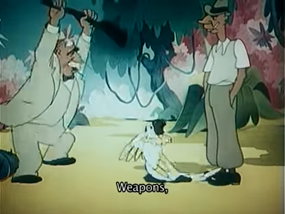{#fig-wolfa}

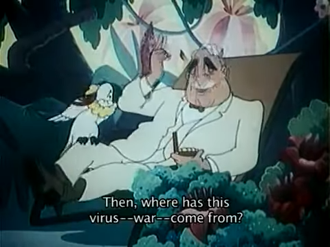{#fig-wolfb}

Stills from Mister Volk [-@gromovMisterVolk1949]
:::

Millioner [-@bordzilovskiyMillioner1963] and Mister Tvister [-@karanovichMisterTvister1963] are both produced in 1963 after the Thaw. We observe a notable change in style from full to limited animation. These two films focus on flatness, lack of perspective. It uses colors for background, which lack of extra detail. According to @furnissArtMotionAnimation1999, limited animation reflects formal design and minimalism. Large chunks of color fields suggest a simplified background space [-@furnissArtMotionAnimation1999, pp. 140]. 

::: {#fig-mill layout-ncol=3}

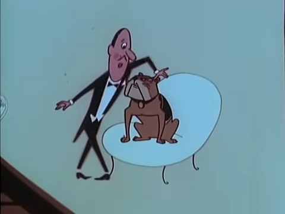{#fig-milla}

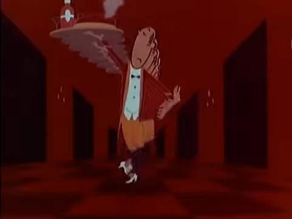{#fig-millb}

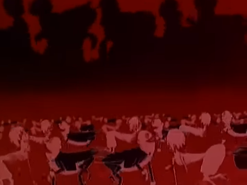{#fig-millc}

Stills from Millioner [-@bordzilovskiyMillioner1963]
:::

Millioner is a combination of full and limited animation. It is Bordzilovskiy's first animated film. The director previously works in Soyuzmultfilm as a art director for other full animation such as Million v meshke in 1956. In 1960 Bordzilovskiy works as the art director for a limited animation 13 reys in 1960. As shown in @fig-milla, the dog is drawn with the full animation technique because of its smooth movement, while other characters have limited movement. The character on the left only moves their hand or their legs at a time to simulate movement, the faces of people in the film remains constant at most of the time. @fig-millb and @fig-millc further shows the limited background and the repetitive movement of multiple characters, creating an abstract depiction of the meanings. For instance, the background in @fig-millb are constructed by a few black shapes which resemble the corridor of the mansion. By simply moving this shape backwards, it demonstrates the large space, signifying the wealth of the owner. In @fig-millc, people are dancing with their hands and feet on the floor, the cutout at the top of the frame shows extend the space of the bar, visually extending the large amount of dancers. 

Mister Tvister further enhance the abstractness of animation film. The director Anatoliy Karanovich starts making animated film in 1957. Karanovich's early works are puppet animation, and Mister Tvister is the director's first limited animated film. The film is framed in an interactive book. As shown in @fig-twisa and @fig-twisb, every scene in this film is constructed by layering papercuts which simulate the perspective by the paper material. All visual elements are constructed in simplicity. As shown in @fig-twisc, the face of the Black man is constructed by simple shapes, and the scene of the hotel manager dialing other hotel managers is shaped like a dial pad in @fig-twisd. It is also worth noting that Mister Tvister makes heavy use of music. Musical instruments and sound effects reflect the mental state of Mr. Twisters' family. For example, when Mr. Twister departs from the United State, the music is on a higher pitch and higher bpm. These characteristics often means happier feelings. When Mr. Twister gets rejected by the hotel, the pace reduces, and the musical instruments produce more gentle sounds. 

::: {#fig-twis layout-ncol=2}

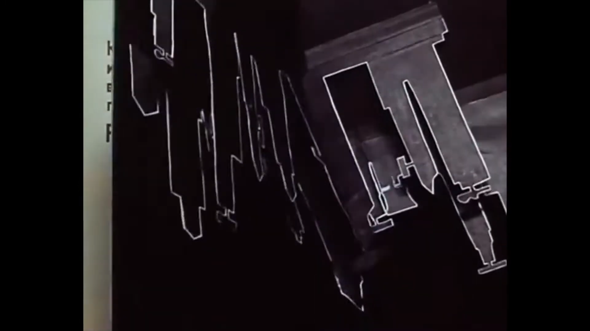{#fig-twisa}

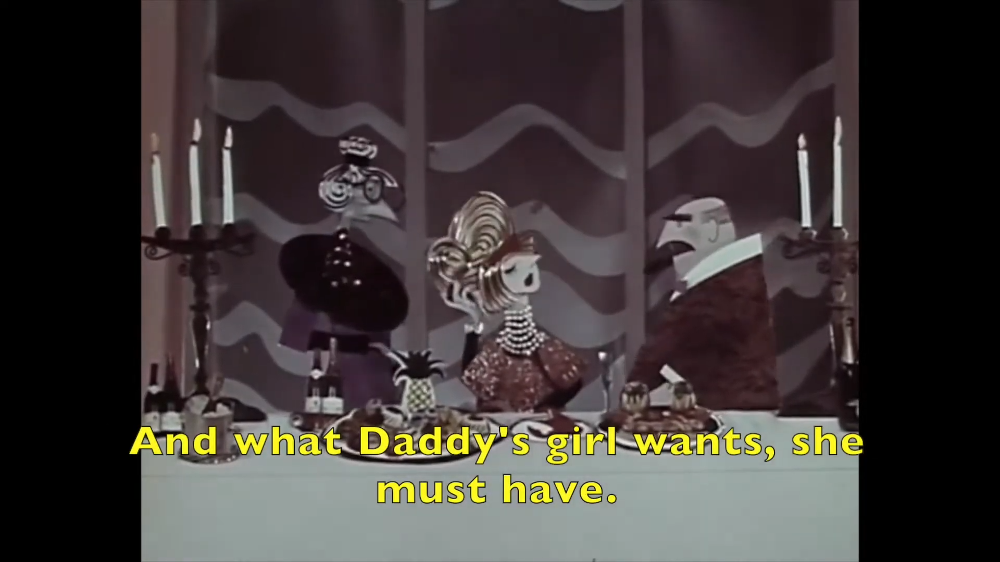{#fig-twisb}

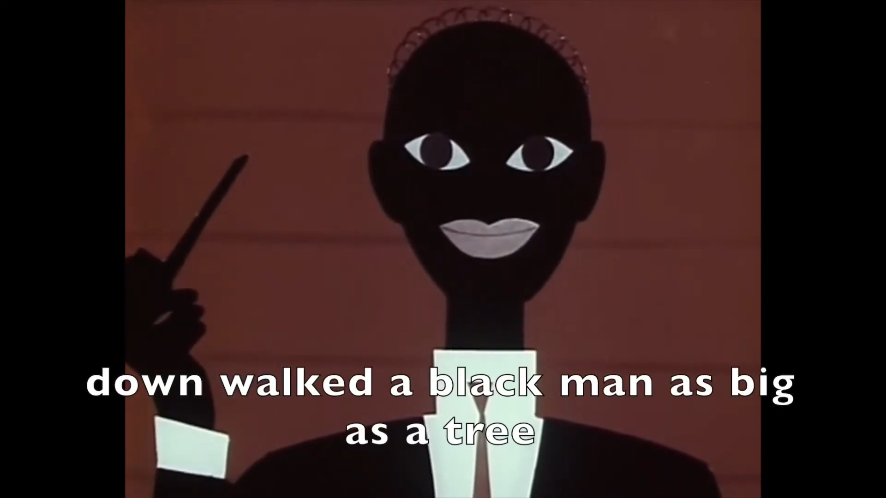{#fig-twisc}

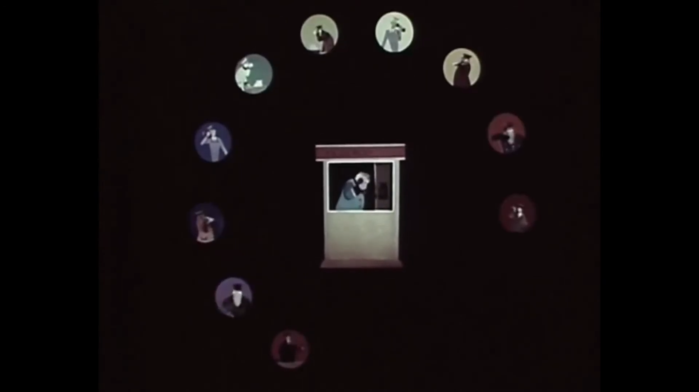{#fig-twisd}

Stills from Mister Tvister [-@karanovichMisterTvister1963]
:::

The differences between the three films reflect the socio-cultural changes in the Soviet Union. First, the characteristics of the two 1963 films both reflect Soyuzmultfilm transition from full animation to limited animation. The early years of Soyuzmultfilm included a great deal of pro-Soviet and anti-capitalist propaganda, and they use Disney’s full, cel animation method as the blueprint. The aesthetic goal of complete animation is to create animations with great diligence and subtle fluidity of motion. This aligns with Josef Stalin and Maksim Gorki’s promotion of socialist realism ideology which focuses on optimistic and realistic representations of the country’s glorious future [@cowenAnimationIronCurtain2020, chap. 4]. The story in Mister Volk also incorporates the socialist realism aspect because it depicts a wealthy family in the US and their disingenuous behavior. On the ideological level, the film criticized capitalism and upper class that reflects the dominant value of the United States. As Pontieri stated, the stories in this time focus on banishing old bourgeoisie, and attacking the rich, racist, and duplicitous capitalists [@pontieriSovietAnimationThaw2012b, pp. 21, 36].

In 1956, three years after the death of Josef Stalin, censorship on artists is lifted in the Nikita Khrushchev’s cultural “thaw”. Theme and graphical style begin to change in Soviet animation [@cowenAnimationIronCurtain2020, chap. 4]. Animation for young people explicitly teaches good behavior and social principles [@pontieriSovietAnimationThaw2012b, pp. 56]. Both film’s targets both children and adults, but they are more child friendly compared to Mister Volk due to the simpler language and meanings, avoiding complicated topics such as politics, war, and oil extraction. The simple visual elements and the music are used to convey ideas and emotions, avoiding imitation of reality. Mister Tvister formats its visual elements as children's books, and the language used in the dialogs are simple and repetitive. The simplicity in language makes understanding the plot easier for children. The plot of the film also dedicates to children. The reason of Mr. Twister getting rejected by the hotel is racial discrimination. The film tries to teach its audiences with racial equality as the good behavior. In this era, satire reappears in animation aimed at adults. Satire is a “corrective tool” against society, attacking foreign countries while mocking domestic weaknesses [@pontieriSovietAnimationThaw2012b, pp. 66]. The film Millioner falls in the Satire category. It is attacking the American system built on wealth. However, there are two notable differences between Millioner and Mister Volk. First, the story in Millioner has more sense of humor. It bases the plot around a dog, which entertains the audience that include both adults and children. Second, its conclusion is that money and wealth can ruin a country. This is not only ironic for the US, but it is also an educational message for the USSR to precent corruption from the wealthy people.

# Propaganda Films in PRC
Animated Film in PRC originates in the northeastern provinces colonialized by Japan [@duAnimatedEncountersTransnational2019, pp. 69]. After the world war in 1950, the communist party take over the area and transferred the Chinese and Japanese artists from Changchun to Shanghai. Like Soyuzmultfilm, a new animation studio Shanghai Film Studio was formed by joining various individual animation studio. 

The three films we choose are Shui Chang De Zui Hao by Xi Jin in 1958, Yu Tong by Wan Guchan in 1959, and Tai Yang De Xiao Ke Ren by Xu Jingda in 1961. They are all produced by the newly merged Shanghai Animation Film Studio. 

Shui Chang De Zui Hao [-@jinShuiChangZui1958] is a puppet animation directed by Xi Jin. The director starts his career as a screenwriter for a full animation film Xiao Tie Zhu in 1951 directed by artists from northeastern China such as Te Wei and Tadahito Mochinaga. Xi Jin then starts to direct puppet animations in the following years. He directed the first live action puppet animation in China Xiao Mei De Meng in 1954 and the award-winning puppet animation Shen Bi in 1956 before directing Shui Chang De Zui Hao. As shown in @fig-shuia, the technique used in the film is puppet animation with wooden toys. The characters in the film are all from the US with lighter skin tones. The film highlights three sites in an American city: a street, an apartment, and an opera house. Every scene highlighting the landscape are filled with advertisements and taglines like @fig-shuic, highlighting the capitalism nature of the city. The background consists of a blurry picture of the city's landscape, such as the scene in @fig-shuib. It is blurred by the window in the apartment or the blur effect of camera lens, creating a sense of depth. The music in the film is like Chinese nursery rhyme, although the story takes place in an American city. 

::: {#fig-shui layout-ncol=3}

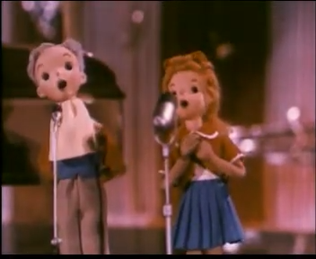{#fig-shuia}

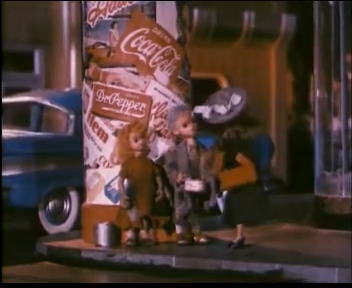{#fig-shuib}

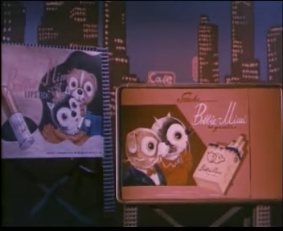{#fig-shuic}

Stills from Shui Chang De Zui Hao [-@jinShuiChangZui1958]
:::

Yu Tong [-@wanYuTong1959] in 1959 employs the paper cutout animation invented by the director Wan Guchan, one of the pioneering Wan brothers who revolutionized the Chinese animation industry. This method combines traditional Chinese shadow play and paper cutting with animation techniques. Characters in Yu Tong are following a distinct Chinese aesthetic. As shown in @fig-yuto1a, the protagonist, Yu Tong, is portrayed as a classical Chinese child with big eyes, thick eyebrows, arms and legs like lotus root, and black hair. The other protagonists include a missionary from the West dressed in black and an old fisher as a peasant, as shown in @fig-yuto1c. The background of the film specially reflects the traditional Chinese art with a mixture of Japanese influence, like @fig-yuto1b, and the music in background is played with traditional Chinese instruments. Based on the overall theme of the film, it is targeting children. 

::: {#fig-yuto1 layout-ncol=3}

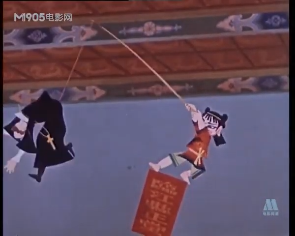{#fig-yuto1a}

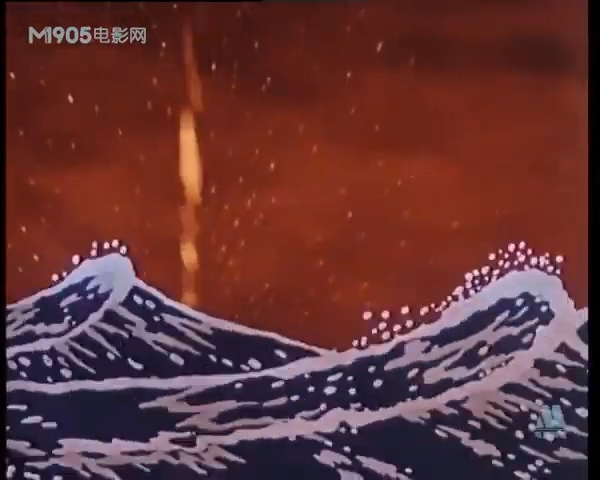{#fig-yuto1b}

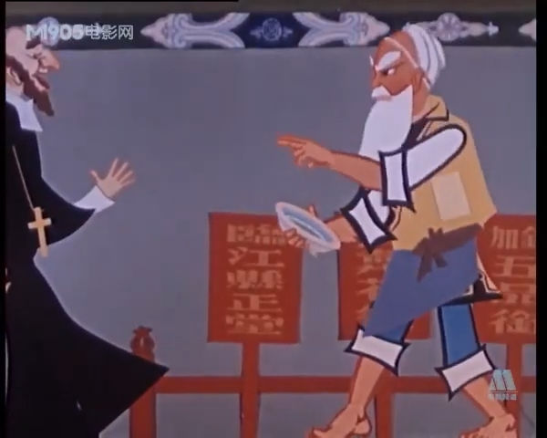{#fig-yuto1c}

Stills from Yu Tong [-@wanYuTong1959]
:::

Tai Yang De Xiao Ke Ren [-@xuTaiYangXiao1961] is directed by Xu Jingda in 1961. This is a full animation film compared to the other ones. As shown in @fig-taiy1a, the animation employs extreme squash and stretch techniques because the ball is stretched to signify movement. The characters include kids from all over the world, the god of sun, and the government officials in the US cities. Like Yu Tong, the background art of the film uses traditional Chinese painting techniques to create a sense of depth and cultural context. In @fig-taiy1b, the god of sun is standing in front of a background painted by Chinese traditional watercolor techniques. The theme and overall tone are a blend of children's entertainment and cultural education aimed at young audiences.

::: {#fig-taiy1 layout-ncol=2}

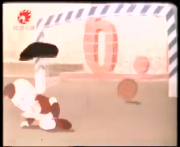{#fig-taiy1a}

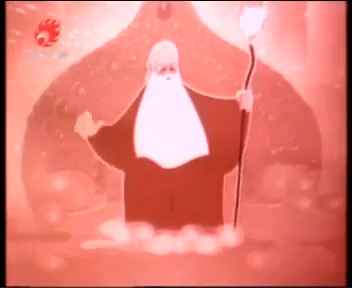{#fig-taiy1b}

Stills from Tai Yang De Xiao Ke Ren [-@xuTaiYangXiao1961]
:::

In the three PRC films we observe a significant change in the art style and storytelling. The changes in animated films are reflection of social and political shifts inside and outside China. In the early years, the animation studio followed the cultural bureau's guideline and produces animation targeting children [@duAnimatedEncountersTransnational2019, pp. 97]. Between 1953 and 1959, inspired by the Soviet model, the government controlled all film production in mainland China, socialist realism borrowed from the Soviet Union is adopted as the dominant principle of cultural production [@duAnimatedEncountersTransnational2019, pp. 116]. We observe this trend in Shui Chang De Zui Hao. The background setup in the film precisely reflects an American city. In @fig-shuib, advertisement from Coca-Cola dominates the pole, the skyscraper in @fig-shuic are filled with billboards with English letters. Animations in this era are called the "international style", which reflect life in other countries but targets domestic audiences. The storytelling in Shui Chang De Zui Hao also closely resembles the socialist realism in the USSR. The symbols in the film signify both the United States and capitalism. By showing the poor living condition of the two kids, the film shows the marginalization of people living in a capitalism society to the domestic audiences. This method of story telling is identical to Mister Volk in the Stalin period.

From 1958, Mao launched the Great Leap Forward, with the deterioration of Sino-Soviet relations in the late 1950s, the CCP deviated from the socialist realism. In this era, elements of "revolutionary romanticism" such as myths, folklore, legends, and fantasies are permitted. Because of the failure in the Great Leap Forward, Mao relaxes ideological control over art and artists, like the thaw [@duAnimatedEncountersTransnational2019, pp. 117]. However, the relaxation in control does not cause more satire or educational children's film like USSR. Instead, it inspires nationalism among Chinese artists. Animations and propaganda incorporate traditional Chinese culture to promote the Chinese national identity, the majorities of the stories are based in China.

In Yu Tong we see a major shift in art style. For example, recurring motifs including lotus and Chinese ware reinforce the film's themes and cultural context of traditional Chinese art. The porcelain in @fig-yuto2a has a very distinct celadon pattern, lotus flower, and a festive red color. The film divides the characters of the play into two factions, one of which is the commoners represented by peasants in @fig-yuto2b, fishers and the masses, and the other side is the forces of evil represented by the imperial officials and foreign missionaries in @fig-yuto2c. In the final scene, the foreign missionaries cooperate with the government officials, claiming the fisherman's porcelain is his property. in @fig-yuto1a, the spirit of the porcelain jumped out of the porcelain and punished the foreign missionary. The animation of metamorphosis is used in this scene. The porcelain is transformed into a child, revealing the true nature of the character，creating a linearity between the Chinese identity and the object [@wellsUnderstandingAnimation1998, pp. 69]. In this scene, the children in the porcelain can be interpreted as the pure spirit of objects made in China. The desire of foreign missionaries for Chinese porcelain reflects the semi-feudal and semi-colonial nature of China from the Qing Dynasty to the Republic of China. By choosing commoners over foreigners, porcelain confirms the orthodoxy of traditional Chinese culture. 

::: {#fig-yuto2 layout-ncol=3}

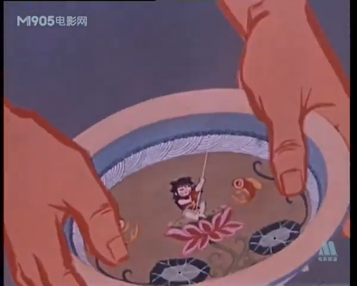{#fig-yuto2a}

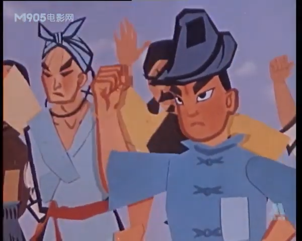{#fig-yuto2b}

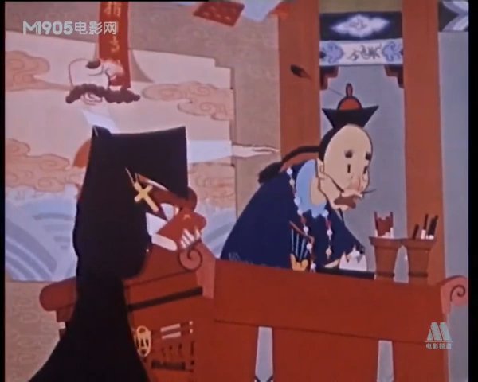{#fig-yuto2c}

Stills from Yu Tong [-@wanYuTong1959]
:::

::: {#fig-taiy2 layout-ncol=3}

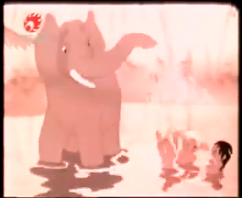{#fig-taiy2a}

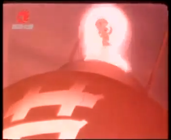{#fig-taiy2b}

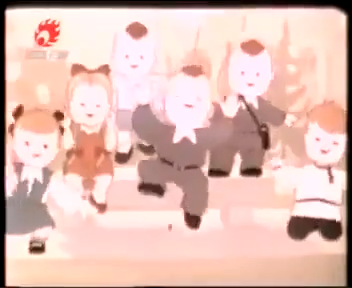{#fig-taiy2c}

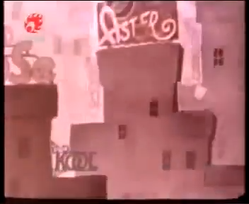{#fig-taiy2d}

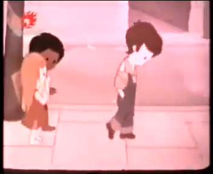{#fig-taiy2e}

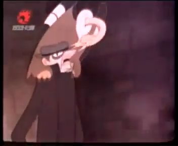{#fig-taiy2f}

Stills from Tai Yang De Xiao Ke Ren [-@xuTaiYangXiao1961]
:::

In Tai Yang De Xiao Ke Ren, the director further discusses the status of Chinese traditional culture. The story is about how, on Children's Day, the Sun God invites children from all over the world to a party in the sky, and the children from all over the world help the children from the United States escape government regulation to participate in the party. The film still has socialist realism aspect in it because the living condition depicted in @fig-taiy2e is poor and the English text and skyscraper in @fig-taiy2d indicates United States。 The symbols are reflecting a realistic live under capitalism. In comparison, kids in other regions in @fig-taiy2a and @fig-taiy2c has better living conditions. The eagle in @fig-taiy2f also signifies the symbol of the US in an analogous way to the USSR films. The Chineseness is reflected by the recurring symbol of lanterns and background in Chinese traditional artistic style. More importantly, in @fig-taiy2b, the spirit of fire jumps out of a lantern, instead of coming from the sky, showing that the god of the sun and spirits of fire on the sky are originated from China. At the end of the film, the spirit of fire rescued the kids from the US law enforcement, helping them attending the party held by the god of sun, who is originated from Chinese tradition. This extend the nationalism further, because the discussion is not limited to the definition of the Chineseness. Compared to the USSR animation, the Chinese animation rarely discusses the problem with ideology, rather they focus on a national symbol. In Yu Tong, the confrontation is between the peasants and foreigners. The peasants protect the Chinese national identity from evil government officials collaborating with foreigners with the help from authentic traditional Chinese heritage. In Tai Yang De Xiao Ke Ren, the Chineseness expands worldwide, becoming a status of peace on the global scale. The extension of the peace represented by the spirit of fire confront capitalism represented by the US, saving kids from the negative effect of capitalism.

# Conclusion

The evolution of propaganda animation in the USSR and PRC demonstrates how political ideology shapes expression in animation. Early Soviet animations adhered to socialist realism and anti-capitalist messaging. In post-Stalin era, we observe a shift toward abstraction and satire. In contrast, Chinese animation initially copied Soviet socialist realism, but later embraced traditional cultural elements to promote Chinese nationalism. 

\newpage

# References

::: {#refs}
:::

\appendix

# Abstract of Shui Chang De Zui Hao [-@jinShuiChangZui1958]

In a city in a Western country, there are two homeless children - a brother, Silver Hair, and a sister, Blonde Hair - who earn their living by selling songs on the streets. Their fate was as uncertain as a pair of street dogs and cats. One day, the radio announces a singing contest organized by Radio Wala Wala, with a huge prize of 100,000 yuan. A woman who calls herself a “philanthropist” hears the news and is attracted by Silver and Blonde's singing voice. Thinking it will be profitable, she adopts Silver and Blonde to practice singing at home in preparation for the contest. Another speculator adopts the stray dogs and cats and prepares to sell them at a high price as a “good breed”. He then hears the announcement of the contest and decides to name the dogs and cats and form a band to compete. When the contest begins, the claptrap singer and the “cat and dog duo” are reviled, while the silver-haired and blonde siblings are warmly welcomed by the audience for their wonderful performance. However, the judges of the competition thought otherwise, and agreed that the “cat and dog duet” was creative and elegant art, and eventually gave the grand prize to the speculator's “cat and dog” duo. The speculator received contracts from movie studios, publishers and other bosses, and was invited by the mayor to a dinner party, the cat and dog became the star of the city, so the speculator made a fortune. But the hard-working female “philanthropist” stops being philanthropic and kicks Silver and Blonde out of the house, leaving the two siblings back on the streets.

# Abstract of Yu Tong [-@wanYuTong1959]

After the Opium War, the imperialists occupied China's harbours and forbade the fishermen to go out to sea to fish, so the fishermen had a lot of complaints.There is an old fisherman forced to make a living, and one night the fisherman catches a Chinese ware. The old fisherman returned home disappointed and put the ware on the table. In the middle of the night, the painted girl on the ware jumped out of the bowl and fished with a fishing rod in the basin, turning out many large pearls. The fisherman woke up and was so amazed that he knew it was a treasure. The next day, he sold the pearls on the market and dreamed of having money to build a new fishing boat in the future. However, this secret was known to a foreign cleric, who wanted to take over the bowl, so he colluded with the government and took the fisherman to the public court. The foreign clergyman said that the bowl belonged to him. The officials followed the foreigners and forced the fisherman to return the bowl. The fisherman was furious and rebuked them righteously. In order to prevent the bowl from falling into the hands of the foreigners, he smashed the bowl to pieces in public in the public court. At that moment, girl in the bowl jumped out again. She threw up his fishing rod and threw the foreign clergyman into the sea.

# Abstract of Tai Yang De Xiao Ke Ren [-@xuTaiYangXiao1961]

For the first time in his history, the God of Sun decided to invite the children of Earth to his palace for Children's Day. So the God of Sun commissioned the Messenger of Fire to go to Earth to deliver the good news. On Earth, the children were happy and carefree during their holiday. At the same time, there are still many children living in war and poverty, who are worried about having enough to eat, picking up garbage all over the place and at the same time are subjected to cynicism and incapable of hurling insults. The Messenger of Fire and other children help the children in the war and poverty to go to the party without the obstruction of the police.